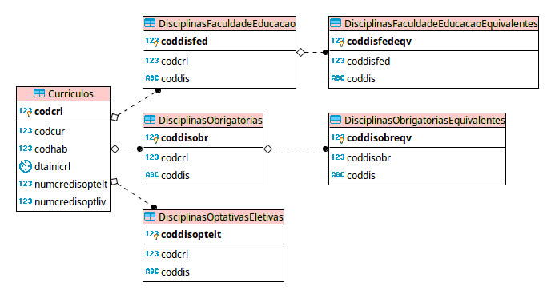

## Conceito

Ferramenta para auxiliar na verificação das disciplinas cursadas pelos alunos e no levantamento das pendências para a conclusão do seu curso. A ferramenta deve ser acessada pelo navegador com acesso restrito aos servidores do Serviço de Graduação, consultar o resumo escolar dos alunos pela replicação do Júpiter e fazer a comparação com um currículo previamente cadastrado.

## Justificativa

O sistema Júpiter não foi concebido para verificar as alterações que ocorrem dentro do mesmo currículo para anos diferentes de ingresso.

## Tela inicial

A ferramenta deve extrair dos dados do Júpiter de duas formas: individual, através do nº USP ou, por grupo de alunos, através da informação do ano de ingresso, curso e habilitação desejados. 

## Dados Júpiter

A Ferramenta deve coletar da replicação do Júpiter:

- Nº USP
- Nome
- Curso
- Habilitação
- Ano de ingresso
- Disciplinas com aprovação, com o respectivo número de créditos aula e trabalho.

## Currículo

Esses dados devem ser comparados com o currículo previamente cadastrado na ferramenta pelo Serviço de Graduação, que conterá:

- Curso
- Habilitação
- Ano de ingresso
- Disciplinas obrigatórias
- Disciplinas optativas eletivas
- Disciplinas da Faculdade de Educação (para cursos de licenciatura)
- Nº de créditos-aula exigidos em disciplinas optativas eletivas
- Nº de créditos-aula exigidos em disciplinas optativas livres

## Funcionalidades

- O aluno de Graduação pode acessar o sistema e ver as disciplinas que já cursou e as que faltam. :heavy_check_mark: 
- O Serviço de Graduação pode: 
    - Cadastrar os currículos de acordo com suas alterações ao longo dos anos. :heavy_check_mark: 
    - Cadastrar as equivalências entre as disciplinas. :heavy_check_mark: 
    - Cadastrar dispensas de disciplinas de um ano dentro de um currículo. :heavy_check_mark:
    - Buscar alunos pelo nº USP ou por parte do nome. :heavy_check_mark: 
    - Emitir um relatório a ser entregue ao aluno em PDF. :heavy_check_mark:
    - Copiar a estrutura de disciplinas de um currículo já cadastrado. 
    - Emitir um relatório PDF com situação de todos os alunos de um currículo.

## Model



## Procedimentos de deploy
 
- Adicionar a biblioteca PHP referente ao sgbd da base replicada

```bash
composer install
cp .env.example .env
```

- Incluir a lib libxrender1

```bash
sudo apt-get install libxrender1
```

- Editar o arquivo .env
    - Dados da conexão na base do sistema
    - Dados da conexão na base replicada
    - Nº USP dos funcionários da secretaria / Serviço de Graduação da unidade que acessarão o sistema
    - Nº USP do aluno (desenvolvimento) para simular o acesso como aluno de Graduação
        - Em desenvolvimento: setar APP_ENV como dev e setar COPES_ALUNO com o Nº USP do aluno
        - Em produção: setar APP_ENV como prd e deixar CODPES_ALUNO em branco
    - Código da unidade local
    - Credenciais do wsfoto
    - Prefixo dos códigos de disciplinas de graduação oferecidas da unidade
    - Quantidade mínima de caracteres digitados para busca por parte do nome

As diretivas específicas do sistema `CCG` estão documentadas em `config/ccg.php`

- Configurações finais do framework e do sistema:

```bash
php artisan key:generate
php artisan migrate
```

- Publicando assets do AdminLTE

```bash
php artisan vendor:publish --provider="JeroenNoten\LaravelAdminLte\ServiceProvider" --tag=assets --force
```

- Adicione permissão de escrita na pasta storage

Caso falte alguma dependência, siga as instruções do `composer`.

## Projetos utilizados

github: [uspdev/replicado](https://github.com/uspdev/replicado)

github: [jeroennoten/Laravel-AdminLTE](https://github.com/jeroennoten/Laravel-AdminLTE)

github: [uspdev/senhaunica-socialite](https://github.com/uspdev/senhaunica-socialite)

github: [uspdev/wsfoto](https://github.com/uspdev/wsfoto)

github: [laravel-snappy](https://github.com/barryvdh/laravel-snappy)


## Contribuindo com o projeto

### Passos iniciais

Siga o guia no site do [uspdev](https://uspdev.github.io/contribua)

### Padrões de Projeto

Utilizamos a [PSR-2](https://www.php-fig.org/psr/psr-2/) para padrões de projeto. Ajuste seu editor favorito para a especificação.
